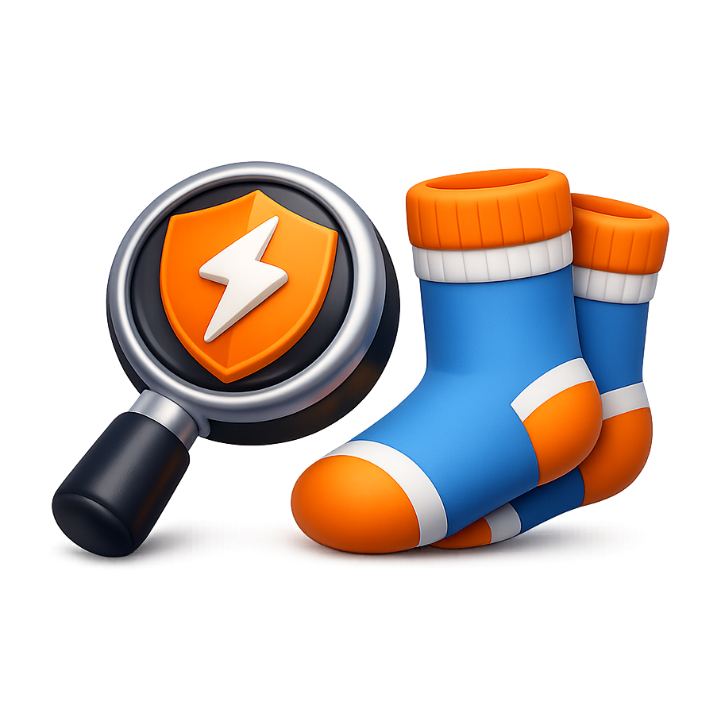

# QuickSocks - SOCKS Proxy Manager for Burp Suite

<div align="center">




**A powerful Burp Suite extension for managing multiple SOCKS proxy profiles with quick toggle functionality.**

[Features](#-features) • [Installation](#-installation) • [Usage](#-usage) • [Building](#-building-from-source) • [Contributing](#-contributing)

</div>

---

## 📋 Overview

**QuickSocks** is a Burp Suite extension that simplifies SOCKS proxy management. Whether you're pentesting through multiple networks, switching between VPN connections, or managing different proxy configurations, QuickSocks makes it effortless.

### Why QuickSocks?

- 🚀 **Quick Toggle**: Enable/disable SOCKS proxy with a single click
- 📝 **Multiple Profiles**: Create and manage unlimited proxy configurations
- 🔐 **Authentication Support**: Full SOCKS authentication with username/password
- 🌐 **DNS over SOCKS**: Route DNS queries through your SOCKS proxy
- 💾 **Import/Export**: Share profiles across teams or backup your configurations
- 🧪 **Connection Testing**: Built-in IP checker to verify proxy connections
- 🎨 **Clean UI**: Intuitive interface that fits seamlessly into Burp Suite

---

## ✨ Features

### Profile Management
- Create, edit, duplicate, and delete SOCKS proxy profiles
- Each profile stores:
  - Profile name
  - Host and port
  - Optional authentication (username/password)
  - DNS over SOCKS setting
- Visual indicator for active profile
- Profiles persist between Burp Suite sessions

### Quick Toggle
- Large, easy-to-use toggle button for enabling/disabling proxy
- Real-time status display (ACTIVE/DISABLED)
- Applies settings instantly to Burp Suite

### Import/Export
- Export profiles to JSON for backup or sharing
- Import profiles with merge or replace options
- Compatible across different Burp Suite installations

### Connection Testing
- Test your proxy connection with a single click
- Displays your current IP, location, and ISP
- Validates proxy is working correctly
- Uses ipinfo.io API for geolocation data

### User Interface
- Profile table with quick activation
- Color-coded active profile highlighting
- Dropdown selector for quick profile switching
- Intuitive edit/delete operations
- Responsive design

---

## 🚀 Installation

### Option 1: Pre-built JAR (Recommended)

1. Download the latest `QuickSocks-X.X.X-jar-with-dependencies.jar` from the [Releases](https://github.com/thezakman/QuickSocks/releases) page
2. Open Burp Suite
3. Go to **Extensions** → **Installed**
4. Click **Add**
5. Select the downloaded JAR file
6. Click **Next**
7. QuickSocks should now appear in your Burp Suite tabs!

### Option 2: BApp Store (Coming Soon)

QuickSocks will be available through the official Burp Suite BApp Store.

---

## 📖 Usage

### Creating Your First Profile

1. Open the **QuickSocks** tab in Burp Suite
2. Click **Add** to create a new profile
3. Fill in the profile details:
   - **Profile Name**: A descriptive name (e.g., "My VPN", "Test Proxy")
   - **Host**: The SOCKS proxy host (e.g., `localhost`, `proxy.example.com`)
   - **Port**: The SOCKS proxy port (typically `1080`)
   - **Username** (optional): For authenticated proxies
   - **Password** (optional): For authenticated proxies
   - **DNS over SOCKS**: Check to route DNS through the proxy
4. Click **Save**

### Activating a Proxy

**Method 1: Quick Toggle**
1. Select your desired profile from the dropdown
2. Click the large **OFF** button (it will turn green and show **ON**)

**Method 2: Table Selection**
1. Click on a profile in the table
2. Click the **Activate** button (or double-click the profile)

### Managing Profiles

- **Edit**: Select a profile and click **Edit**
- **Delete**: Select a profile and click **Delete**
- **Duplicate**: Select a profile and click the duplicate icon
- **Export**: Click **Export** to save all profiles to a JSON file
- **Import**: Click **Import** to load profiles from a JSON file

### Testing Your Connection

1. Ensure a profile is activated
2. Click the **Test IP** button
3. View your connection details:
   - Current IP address
   - City, Region, Country
   - ISP/Organization

---

## 🛠 Building from Source

### Prerequisites

- Java 17 or higher
- Maven 3.6+
- Git

### Build Steps

```bash
# Clone the repository
git clone https://github.com/thezakman/QuickSocks.git
cd QuickSocks

# Build with Maven
mvn clean package

# The JAR will be in the target/ directory
# Look for: QuickSocks-1.0.0-jar-with-dependencies.jar
```

### Development

```bash
# Compile
mvn compile

# Run tests (if available)
mvn test

# Package without running tests
mvn package -DskipTests
```

---

## 📁 Project Structure

```
QuickSocks/
├── src/
│   └── main/
│       ├── java/
│       │   ├── burp/
│       │   │   └── BurpExtender.java          # Extension entry point
│       │   └── com/tzm/dirtysocks/
│       │       ├── Constants.java              # VERSION & app constants (SINGLE SOURCE OF TRUTH)
│       │       ├── DirtySocksUI.java           # Main UI controller
│       │       ├── model/
│       │       │   ├── ProfileManager.java     # Profile management logic
│       │       │   └── SocksProfile.java       # Profile data model
│       │       ├── service/
│       │       │   └── SocksProxyService.java  # Burp API integration
│       │       └── ui/
│       │           ├── MainTab.java            # Main tab UI
│       │           ├── ProfileEditDialog.java  # Profile editor dialog
│       │           └── QuickTogglePanel.java   # Toggle component
│       └── resources/
│           └── logo.png                        # Extension logo
├── pom.xml                                      # Maven configuration
└── README.md
```

**Note:** The version number is centralized in [Constants.java](src/main/java/com/tzm/dirtysocks/Constants.java) - update it there when releasing new versions.

---

## 🔧 Configuration

QuickSocks stores all configuration in Burp Suite's extension preferences. This includes:

- All proxy profiles
- Active profile selection
- Proxy enabled/disabled state

**No external configuration files are needed!**

---

## 🤝 Contributing

Contributions are welcome! Here's how you can help:

1. **Fork** the repository
2. **Create** a feature branch (`git checkout -b feature/amazing-feature`)
3. **Commit** your changes (`git commit -m 'Add amazing feature'`)
4. **Push** to the branch (`git push origin feature/amazing-feature`)
5. **Open** a Pull Request

### Ideas for Contributions

- Add support for SOCKS4/SOCKS5 protocol selection
- Implement profile groups/categories
- Add proxy chain support
- Create keyboard shortcuts
- Improve error handling
- Add more connection tests

---

## 🐛 Bug Reports

Found a bug? Please open an issue on [GitHub Issues](https://github.com/thezakman/QuickSocks/issues) with:

- Description of the bug
- Steps to reproduce
- Expected behavior
- Actual behavior
- Burp Suite version
- Java version
- Extension version

---

## 📜 License

This project is licensed under the **Apache License 2.0** - see the [LICENSE](LICENSE) file for details.

```
Copyright 2026 TheZakMan

Licensed under the Apache License, Version 2.0 (the "License");
you may not use this file except in compliance with the License.
You may obtain a copy of the License at

    http://www.apache.org/licenses/LICENSE-2.0

Unless required by applicable law or agreed to in writing, software
distributed under the License is distributed on an "AS IS" BASIS,
WITHOUT WARRANTIES OR CONDITIONS OF ANY KIND, either express or implied.
See the License for the specific language governing permissions and
limitations under the License.
```

---

## 🙏 Acknowledgments

- Built with [Burp Suite Montoya API](https://portswigger.github.io/burp-extensions-montoya-api/)
- IP testing powered by [ipinfo.io](https://ipinfo.io/)
- Uses [Gson](https://github.com/google/gson) for JSON serialization

---

## 📞 Contact

**TheZakMan** - [@thezakman](https://github.com/thezakman)

Project Link: [https://github.com/thezakman/QuickSocks](https://github.com/thezakman/QuickSocks)

---

<div align="center">

**⭐ If you find QuickSocks useful, please consider giving it a star! ⭐**

Made with ❤️ by [TheZakMan](https://github.com/thezakman)

</div>
